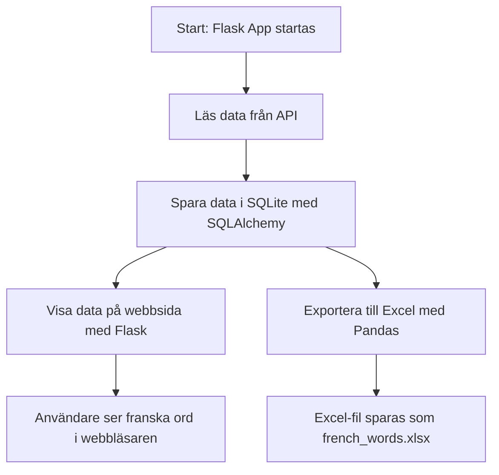

# 🇫🇷 French Words Web App (Flask + SQLite + API)

Ett enkelt Python-projekt som hämtar franska meningar från ett API, sparar till SQLite med SQLAlchemy, och visar datan i en webbsida via Flask.

## 🚀 Funktioner

- Hämtar franska meningar från [LibreTranslate](https://libretranslate.com/)
- Sparar meningar till SQLite-databas
- Webbsida med Flask som visar innehållet
- Kod uppdelad i moduler (`api.py`, `models.py`, `views.py`)
- Valfritt: använd Docker för att köra databasen


## 🧰 Installation

```bash
git clone https://github.com/gulcoder/french-api-flask-app.git
cd french-api-flask-app
python3 -m venv venv
source venv/bin/activate
pip install -r requirements.txt
```

## Användning
```bash
python main.py
```
Besök http://127.0.0.1:5000 i webbläsaren.

## 🧪 Exempel Data

| ID | French Word       | English Translation | Part of Speech |
|----|-------------------|---------------------|----------------|
| 1  | bonjour           | hello               | interjection   |
| 2  | chat              | cat                 | noun           |
| 3  | merci             | thank you           | expression     |
| 4  | apprendre         | to learn            | verb           |
| 5  | fromage           | cheese              | noun           |

